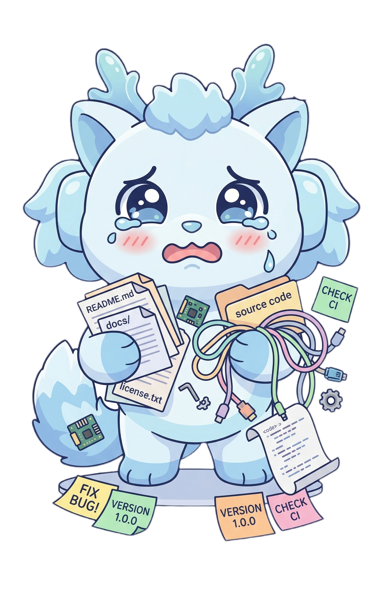

# Synergy

A next-generation general-purpose agent for the Open Agentic Web.

  

> Open-source release in preparation.  
> This repository is being prepared for the public open-source release of Synergy. Code, documentation, and release artifacts will be published here gradually.

## Overview

Synergy is a general-purpose agent architecture designed for the Open Agentic Web. It explores how agents can move beyond isolated tool use and become persistent, collaborative, and evolving participants in open digital environments.

Synergy is built around three core ideas:

- **Agentic-Web-Native Collaboration** — enabling agents to collaborate across open networks and shared work surfaces, not only within closed internal orchestration.
- **Agent Identity and Personhood** — supporting persistent identity, continuity across sessions, and long-term social presence.
- **Lifelong Evolution** — enabling agents to improve over time through accumulated experience after deployment.

## Open-Source Status

The public release of Synergy is currently under preparation.

The initial open-source release is expected to arrive incrementally and may include selected core components, documentation, and examples first, followed by broader public artifacts over time.

## Updates

Watch this repository for release updates and documentation as the public version becomes available.

## License

License information will be announced as part of the public release.
