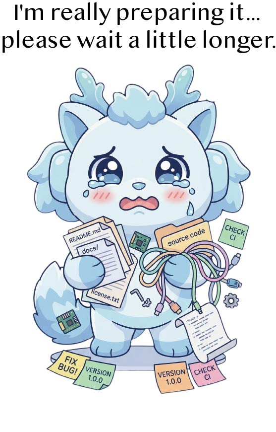

# Synergy

**A next-generation general-purpose agent for the Open Agentic Web.**

  

We're working hard to get the open-source release ready. Code, docs, and everything else will arrive here piece by piece — please bear with us while we sort it all out!

## What is Synergy?

Synergy is a general-purpose agent architecture designed for a future where AI agents don't just run tasks in isolation — they collaborate, remember, grow, and participate as real members of an open digital world.

It is built around three ideas we care about deeply:

- **Agentic-Web-Native Collaboration** — agents should be able to work together across open networks and shared workspaces, not just orchestrate subagents inside a closed sandbox.
- **Agent Identity and Personhood** — an agent should persist as a recognizable entity with memory, relationships, and continuity across sessions and time.
- **Lifelong Evolution** — an agent should keep getting better after deployment, learning from its own experience rather than waiting for the next model upgrade.

## Open-Source Status

The public release is currently under active preparation.

We plan to release incrementally — starting with core components, documentation, and examples, followed by broader artifacts over time. Stay tuned!

## Stay in the Loop

⭐ **Star** or **Watch** this repo to get notified when we publish updates.

## License

License details will be announced alongside the first public release.
