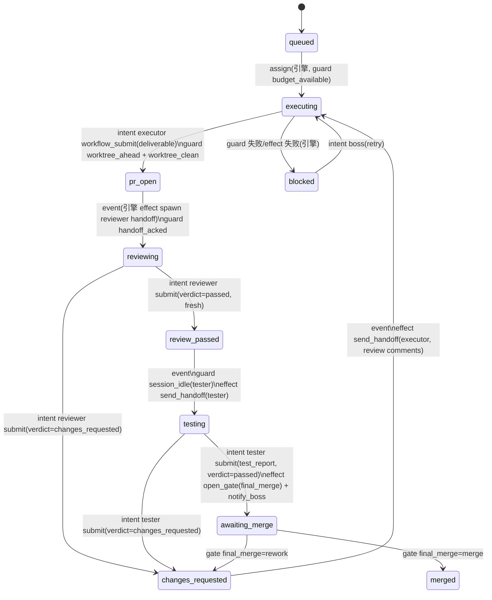

# WorkflowRun / Boss Mode 详细方案(V1)

> 状态机工程:把"多 session 长期协作"建模为平台原生的、数据驱动的工作流实体。
> 本文档是工程设计稿,粒度对齐 `LATTICE_MODE_DETAILED_PLAN_V2.md`。

## Summary

不修改、不迁移、不删除现有 Lattice / BlueprintLoop / SuperPlan / Cortex 代码。新增独立的 **WorkflowRun** 能力:

- **Charter(章程)**:一份 schema 校验的结构化定义,描述一个"公司":席位(Seat)、实体类型(Entity)、状态机(states + transitions)、守卫(guards)、效果(effects)、人类责任节点(gates)。
- **WorkflowRun(运行实体)**:Charter 的一次实例化。scope 级实体,**不绑定单一 session**;它拥有若干持久员工 session(Seat)、若干流经状态机的实体(Entity,如一个 issue / 一条 PR 分支)、一份 append-only 事件日志。
- **Boss Session**:人类唯一交互入口。一个普通 session + run ownership 绑定,gates 在这里 resolve。
- **Boss 面板**:右侧 workspace(workbench side surface)新增面板,run 级可视化:实体看板、席位状态、gate 队列、事件时间线。

分层关系(核心论点:状态机包含 DAG 和 Loop):

```
WorkflowRun(外层生命周期:合法转移、权限门禁、异常恢复、人类 gate)
 └─ 状态内部执行形态(engine effect 按 Charter 触发)
     ├─ BlueprintLoop(反复尝试 + advisor 审计内循环)—— 复用 BlueprintLoopService.createAndStart
     ├─ DAG / Cortex(状态内并行分发)—— 员工 session 自行使用
     └─ 直接执行(简单任务:一次结构化 handoff)
```

### 设计原则(5 条,全文的判断依据)

1. **Guard 只由平台事实驱动,不信 agent 自我汇报。** 转移条件来自 deterministic 事件与存储(loop 终态、worktree status、结构化 submission 记录),复刻 `lattice/bridge.ts` 的模式。禁止自由表达式 DSL——`agenda/types.ts:52-71` 被注释掉的 poll/tool watch 是前车之鉴("agent 猜测工具输出格式太脆弱")。
2. **引擎 push,不是 boss poll。** 状态推进由事件桥 + ContinuationKernel policy 驱动;boss session 只在 gate / blocked / 完成时被唤醒。
3. **引擎独占状态变更;agent 只提交 intent。** 同 `LatticeMachine` 的头注释:"Agent-facing tools only submit patch intents; phase transitions are computed here"。转移带 `allowedSeats`,泛化 `blueprint_loop_finish` 的角色限权(tool/blueprint-loop-finish.ts:92-106)。
4. **一切进事件日志。** 每次转移、guard 失败、effect 执行、handoff、gate 决议都 append 到 run eventLog。审计面板、恢复、预算全部建立在它之上——**不是**建立在全局事件 WS firehose 的过滤之上。
5. **压缩免疫靠系统提示词,不靠事后补救。** 守则(charter prompt)与运行时上下文走 `invoke.ts` Layer 2.5 的每轮重建注入(同 `LatticePrompt.build`),`session.compacted` 事件只做运行时状态回灌的兜底。

### 术语

| 术语        | 含义                                                                                                          |
| ----------- | ------------------------------------------------------------------------------------------------------------- |
| Charter     | 结构化的公司定义(席位+状态机+守卫+效果+gate),版本化不可变                                                     |
| WorkflowRun | Charter 的运行实例,scope 级                                                                                   |
| Seat        | 员工席位。持久 session,绑定守则、agent、控制档位、worktree 策略;可配 `pool: N` 支持并行分身                   |
| Entity      | 流经状态机的工作单元(issue / PR 分支),各自持有独立状态                                                        |
| Gate        | 人类责任节点。阻塞某个转移,直到 boss session 中被 resolve                                                     |
| Contractor  | 外包 agent:一次性 hidden Cortex 任务,结果以结构化 submission 落回 entity,用后归档                             |
| Submission  | seat 通过 `workflow_submit` 写入的结构化结论(review verdict / test report / deliverable),guard 的事实来源之一 |
| Handoff     | 引擎投递给 seat 的结构化任务(带上下文引用与 ack 语义)                                                         |

### 与现有系统的关系

| 现有能力                                      | 本方案如何对待                                                                                                                                                                                                                    |
| --------------------------------------------- | --------------------------------------------------------------------------------------------------------------------------------------------------------------------------------------------------------------------------------- |
| Lattice(`src/lattice/`)                       | 不动。范式来源:machine/bridge/policy/store/prompt/route/test 七件套逐一复刻                                                                                                                                                       |
| BlueprintLoop(`src/blueprint/`)               | 不动,作为 effect 复用 `BlueprintLoopService.createAndStart`(service.ts:210 注释本就写着 "primary entry point for external orchestrators")。仅在 `SessionWorkflowService.assertBlueprintLoopAllowed` 增加一个 source 分支(见 1.12) |
| SuperPlan(`src/superplan/`)                   | 不动。数据形状(node↔session↔worktree↔commit 绑定链)被借鉴进 Entity bindings                                                                                                                                                    |
| ContinuationKernel                            | 注册一个新 policy(priority 40,低于 blueprint_loop=100 / lattice=50),不改内核                                                                                                                                                      |
| session_send / session_control / session_read | 不动。boss 的手工兜底手段;引擎内部走 `SessionManager.deliver`(与 lattice/blueprint 同路径)                                                                                                                                        |
| Cortex                                        | 不动。contractor = `visibility: "hidden"` 的 Cortex 任务                                                                                                                                                                          |
| Agenda                                        | 不动。Phase 3 可选:巡检型 charter 用 agenda 触发                                                                                                                                                                                  |
| `session/workflow.ts`(SessionWorkflowService) | 命名撞车说明:那是 **session 级模式投影**(plan/lightloop/lattice);本方案是 **scope 级运行实体**,模块名取 `workflow-run/` 以避开                                                                                                    |

---

## Phase 0:Session Charter(守则注入与压缩免疫)

独立价值:任何长程 session(agenda 持久 session、手工开的员工 session)都能拥有"永不被压缩掉的守则"。Phase 1 的 Seat 直接建立在它之上。

### 0.1 数据模型

`packages/synergy/src/session/types.ts` 的 `Info` 增加可选字段(紧挨 `blueprint` / `superplan`,同为投影字段):

```ts
charter: z
  .object({
    noteID: z.string(),
    version: z.number().optional(),   // 缺省 = 最新版
  })
  .optional()
  .describe("Charter note injected into the system prompt every turn (compaction-immune)"),
```

可选字段、无迁移(`session/migration.ts` 不需要动;旧 session 读出来就是 undefined)。

### 0.2 注入点:invoke.ts Layer 2.5

`session/invoke.ts:595` 的 "Layer 2.5: Semi-static workflow / BlueprintLoop context" 已经是每轮重建、参与 prompt 分层缓存的注入点。在 `switch (session?.workflow?.kind)` 之前追加:

```ts
// Layer 2.4: Session charter (compaction-immune standing instructions)
if (session?.charter) {
  const note = await NoteStore.getAny(scopeID, session.charter.noteID).catch(() => undefined)
  if (note) {
    systemParts.push(
      [
        "<session-charter>",
        `This session operates under a standing charter (note ${note.id}, v${note.version}).`,
        "The charter below survives context compaction. Re-ground yourself in it whenever prior context is missing.",
        "",
        note.content,
        "</session-charter>",
      ].join("\n"),
    )
  }
}
```

架构注意:放在 Layer 2.5 的 workflow 分支**之前**,因为 Phase 1 的 seat 注入(WorkflowPrompt)要引用 charter 的内容锚点;且 charter 相对静态,利于缓存分层(注释 "This ordering maximizes prompt caching")。

### 0.3 note kind 扩展

`note/types.ts` 中 4 处 `kind: z.enum(["note", "blueprint"])` → `z.enum(["note", "blueprint", "charter"])`。

理由:与 Blueprint 完全同构——结构化记录(loop / seat)引用一份人类可编辑、版本化的 note 作为契约文档。charter note 获得:note 面板编辑、版本历史、`note_read` 工具可达。前端 note 列表增加 kind 徽标(与 blueprint 徽标同处理,改动极小)。

可选跟进:`note/charter-policy.ts` 仿 `blueprint-policy.ts`,约束"被活跃 run 引用的 charter note 禁止就地修改,必须出新版本"(Phase 1 落地时加)。

### 0.4 压缩后回灌:charter-recall

新文件 `packages/synergy/src/session/charter-recall.ts`:

```ts
export namespace CharterRecall {
  export function init(): () => void
  // Bus.subscribe(SessionCompaction.Event.Compacted, ...)
}
```

行为:收到 `session.compacted` 后,若 session 有 `charter` 或(Phase 1 起)`workflowRun` 绑定,通过 `SessionManager.deliver` 投递一条 `mode: "context"` 的 synthetic 消息(inbox 语义见 `session/inbox.ts:26-29`——context 模式只搭车,不主动唤醒):

- 守则本体**不重复**(它在系统提示词里);
- 回灌的是**运行时状态**:当前绑定的 entity、手头 handoff、最近一次 submission、"你的完整历史可用 session_read 回看"。

初始化挂载点:`session/invoke.ts:193` 旁,与 `ContinuationKernel.init()` / `LatticeBridge.init()` 并列。这是当前 `session.compacted` 事件的**第一个订阅者**(compaction.ts:549 目前发布无人听)。

### 0.5 session_control 扩展

`tool/session-control.ts` 的 `Action` 枚举增加 `"set_charter"`;参数增加 `charterNoteID?: string`。实现即 `Session.update` 写 0.1 的字段。这让 boss / 人类都能给任意 session 挂守则。

同时在 `server/session.ts` 增加对应 PATCH 路由(操作对称性;前端 note 面板"设为此 session 守则"按钮用)。

### 0.6 测试与验收

- `test/session/charter-injection.test.ts`:有/无 charter 字段时 system parts 的差异;note 不存在时静默降级。
- `test/session/charter-recall.test.ts`:compacted 事件 → inbox 出现 context item;无绑定时不投递。
- 验收:给一个 session 挂守则 → 手动触发 compact(session_control.compact)→ 下一轮系统提示词仍含 `<session-charter>`,且 inbox 有回灌消息。

---

## Phase 1:WorkflowRun 内核

### 1.1 模块布局

```
packages/synergy/src/workflow-run/
├── types.ts          # 全部 zod schema(Charter / Run / Seat / Entity / Gate / Event / Intent)
├── charter-store.ts  # Charter 版本化存储(不可变 per version)
├── store.ts          # Run 存储 + eventLog(仿 lattice/store.ts)
├── machine.ts        # WorkflowMachine:intent → guard → transition → effects(仿 lattice/machine.ts)
├── guards.ts         # 谓词注册表(固定库)
├── effects.ts        # 效果注册表(固定库)
├── bridge.ts         # WorkflowBridge:平台事件 → machine 转移(仿 lattice/bridge.ts)
├── policy.ts         # WorkflowContinuationPolicy(仿 lattice/policy.ts)
├── seats.ts          # Seat session 生命周期(创建/绑定/回收)
├── prompt.ts         # WorkflowPrompt:seat/boss 系统提示词块 + 续跑文案(仿 lattice/prompt.ts)
├── prompt/*.txt      # 提示词文本独立成文件(遵循 Lattice V2 的硬规则)
├── model-calls.ts    # 预算记账(仿 lattice/model-calls.ts)
├── service.ts        # WorkflowRunService:run 生命周期编排(仿 lattice/run-service.ts)
├── builtin/issue-to-pr.ts  # 内置 Charter(验收用例)
├── event.ts          # BusEvent 定义
├── error.ts
└── index.ts
```

### 1.2 ID 与存储

`id/id.ts` 前缀表(32-38 行旁)追加:

```ts
charter: "cht",
workflow_run: "wfr",
workflow_entity: "wfe",
workflow_gate: "wfg",
workflow_event: "wfv",
workflow_handoff: "wfh",
```

`storage/path.ts`(117-145 行旁)追加,遵循既有 `["lattice", "runs", scopeID, ...]` 形状:

```ts
export const charterRoot = (scopeID: ScopeID) => ["workflow", "charters", scopeID as string]
export const charter = (scopeID: ScopeID, charterID: string, version: number) => [
  ...charterRoot(scopeID),
  charterID,
  String(version),
]
export const workflowRunsRoot = (scopeID: ScopeID) => ["workflow", "runs", scopeID as string]
export const workflowRun = (scopeID: ScopeID, runID: string) => [...workflowRunsRoot(scopeID), runID]
export const workflowEventsRoot = (scopeID: ScopeID, runID: string) => ["workflow", "events", scopeID as string, runID]
export const workflowEvent = (scopeID: ScopeID, runID: string, eventID: string) => [
  ...workflowEventsRoot(scopeID, runID),
  eventID,
]
```

与 Lattice 的关键差异:**run 按 runID 键控,不按 sessionID**——一个 scope 可以并存多个 run,一个 run 关联多个 session。

### 1.3 数据 schema(核心节选)

```ts
export namespace WorkflowTypes {
  // ---- Charter(不可变,version 内)----
  export const SeatDef = z.object({
    name: z.string(), // "executor" | "reviewer" | ...
    agent: z.string(), // Agent.get 校验
    charterPrompt: z.string(), // 守则正文;或
    charterNoteID: z.string().optional(), //   引用 kind:"charter" note(二选一,note 优先)
    controlProfile: z.enum(["guarded", "autonomous", "full_access"]).default("autonomous"),
    interaction: z.enum(["unattended", "interactive"]).default("unattended"),
    pool: z.number().int().min(1).default(1), // 并行分身数(图中分支 A/B/N)
    worktree: z.enum(["none", "per_entity", "shared"]).default("none"),
    model: z.object({ providerID: z.string(), modelID: z.string() }).optional(),
    tools: z.record(z.string(), z.boolean()).optional(), // 额外开/关(叠加在门控之上)
  })

  export const PredicateRef = z.object({
    name: z.string(), // 谓词注册表 key,未知名 → charter 校验失败
    args: z.record(z.string(), z.string()).default({}),
    // arg 值只允许三种形态:字面量、"$entity.bindings.<key>"、"$run.<key>"
    // 由固定 resolver 解析 —— 不是表达式语言
  })

  export const EffectRef = z.object({
    name: z.string(),
    args: z.record(z.string(), z.unknown()).default({}),
  })

  export const TransitionDef = z.object({
    id: z.string(),
    from: z.string(),
    to: z.string(),
    trigger: z.discriminatedUnion("kind", [
      z.object({ kind: z.literal("event") }), // bridge 观察到事实后自动尝试
      z.object({ kind: z.literal("intent"), allowedSeats: z.array(z.string()) }),
      z.object({ kind: z.literal("gate"), gate: z.string() }), // 人类决议后触发
    ]),
    guards: z.array(PredicateRef).default([]), // 全部为真才放行;失败记入 eventLog
    effects: z.array(EffectRef).default([]), // 状态写入后按序执行
  })

  export const GateDef = z.object({
    name: z.string(), // "final_merge" | "scope_change" | ...
    title: z.string(),
    description: z.string().optional(),
    resolutions: z.array(z.string()).min(2), // ["merge","rework","pause","cancel"]
  })

  export const Charter = z.object({
    id: Identifier.schema("charter"),
    version: z.number().int().min(1),
    name: z.string(),
    entityType: z.string(), // "issue"
    entityInitialState: z.string(),
    states: z.array(z.string()).min(2), // 含 "blocked" 保留态(引擎强制存在)
    seats: z.array(SeatDef).min(1),
    transitions: z.array(TransitionDef),
    gates: z.array(GateDef).default([]),
    budget: z.object({ maxModelCalls: z.number().int().min(0).default(0) }).default({ maxModelCalls: 0 }),
    time: z.object({ created: z.number() }),
  })

  // ---- Run(可变)----
  export const SeatBinding = z.object({
    seat: z.string(),
    instance: z.number().int().min(0), // pool 内序号
    sessionID: Identifier.schema("session").optional(), // 懒创建
    entityID: Identifier.schema("workflow_entity").optional(), // 当前占用
    status: z.enum(["unbound", "idle", "working", "waiting"]).default("unbound"),
  })

  export const Submission = z.object({
    id: z.string(),
    kind: z.enum(["review_verdict", "test_report", "deliverable", "note_ref"]),
    seat: z.string(),
    sessionID: z.string(),
    verdict: z.enum(["passed", "changes_requested", "blocked"]).optional(),
    summary: z.string(),
    refs: z.array(z.string()).default([]), // noteID / commit / PR URL / sessionID
    time: z.number(),
  })

  export const Entity = z.object({
    id: Identifier.schema("workflow_entity"),
    runID: Identifier.schema("workflow_run"),
    title: z.string(),
    description: z.string().optional(),
    state: z.string(),
    blockedReason: z.string().optional(),
    bindings: z.record(z.string(), z.string()).default({}),
    // 约定键:worktreeID, loopID, blueprintNoteID, prNumber, baseCommit, resultCommit, issueRef
    submissions: z.array(Submission).default([]),
    assignedSeat: z.object({ seat: z.string(), instance: z.number() }).optional(),
    time: z.object({ created: z.number(), updated: z.number(), stateEntered: z.number() }),
  })

  export const GateInstance = z.object({
    id: Identifier.schema("workflow_gate"),
    gate: z.string(),
    entityID: Identifier.schema("workflow_entity").optional(),
    transitionID: z.string(),
    status: z.enum(["pending", "resolved", "expired"]),
    resolution: z.string().optional(),
    resolvedBy: z.enum(["human_ui", "boss_agent"]).optional(), // 人类责任记录
    context: z.string().optional(), // 引擎汇总的决策材料
    time: z.object({ created: z.number(), resolved: z.number().optional() }),
  })

  export const Run = z.object({
    id: Identifier.schema("workflow_run"),
    scopeID: z.string(),
    charterRef: z.object({ id: Identifier.schema("charter"), version: z.number() }),
    title: z.string(),
    status: z.enum(["active", "paused", "completed", "failed", "cancelled"]),
    statusReason: z.string().optional(),
    bossSessionID: Identifier.schema("session"),
    seats: z.array(SeatBinding),
    entities: z.array(Entity),
    gates: z.array(GateInstance),
    budget: z.object({ maxModelCalls: z.number(), used: z.number() }),
    time: z.object({ created: z.number(), updated: z.number(), completed: z.number().optional() }),
  })

  export const EventKind = z.enum([
    "run_created",
    "run_paused",
    "run_resumed",
    "run_completed",
    "run_failed",
    "run_cancelled",
    "entity_added",
    "entity_transitioned",
    "entity_blocked",
    "guard_failed", // 关键:失败不是静默的
    "effect_executed",
    "effect_failed",
    "seat_session_created",
    "seat_assigned",
    "seat_released",
    "handoff_sent",
    "handoff_acked",
    "submission_recorded",
    "gate_opened",
    "gate_resolved",
    "contractor_spawned",
    "contractor_finished",
    "budget_exhausted",
  ])

  export const EventInfo = z.object({
    id: Identifier.schema("workflow_event"),
    runID: Identifier.schema("workflow_run"),
    scopeID: z.string(),
    kind: EventKind,
    entityID: z.string().optional(),
    seat: z.string().optional(),
    transitionID: z.string().optional(),
    message: z.string().optional(),
    data: z.record(z.string(), z.unknown()).optional(),
    time: z.object({ created: z.number() }),
  })
}
```

Session 侧(`session/types.ts`,紧挨 `superplan` 字段,同为投影):

```ts
workflowRun: z
  .object({
    runID: Identifier.schema("workflow_run"),
    role: z.enum(["boss", "seat", "contractor"]),
    seat: z.string().optional(),
    instance: z.number().optional(),
  })
  .optional(),
```

### 1.4 WorkflowMachine

对外只有三个入口,全部串行化到 run 级(`Storage.update` 的读改写即事务边界,同 LatticeStore):

```ts
export namespace WorkflowMachine {
  /** seat/boss 工具提交的意图。校验 allowedSeats + guards 后落转移。 */
  export async function submitIntent(
    scopeID: string,
    input: {
      runID: string
      entityID: string
      transitionID: string
      actor: { sessionID: string } // 由引擎反查 seat 身份,不信参数
      submission?: WorkflowTypes.Submission // workflow_submit 附带
    },
  ): Promise<IntentResult>

  /** bridge 观察到平台事实后,对该 entity 当前状态的所有 event-trigger 转移做一次评估。 */
  export async function evaluateEventTransitions(scopeID: string, runID: string, entityID: string): Promise<void>

  /** gate 决议(路由/工具调用)。 */
  export async function resolveGate(
    scopeID: string,
    input: {
      runID: string
      gateInstanceID: string
      resolution: string
      resolvedBy: "human_ui" | "boss_agent"
    },
  ): Promise<WorkflowTypes.Run>
}
```

单次转移的固定流水(全部在一次 `WorkflowRunStore.update` 内完成状态写入,effects 在写入**之后**异步执行):

```
1. run.status === "active"?  否 → 拒绝(同 machine.ts:47-49)
2. 定位 transition:from === entity.state?  否 → 拒绝
3. intent 触发:actor 的 seat ∈ allowedSeats?  否 → 拒绝(泛化 blueprint-loop-finish.ts:92-106)
4. 逐个评估 guards(谓词库,读平台事实)
   任一失败 → appendEvent("guard_failed", {predicate, reason})
             + 若 charter 声明 blockOnGuardFail(默认 true 仅对 event 触发)
               → entity.state = "blocked" + notify_boss
             + intent 触发则原样返回失败原因给工具调用方(agent 能看到为什么被拒)
5. 写入:entity.state = to; time.stateEntered = now; appendEvent("entity_transitioned")
6. 依序执行 effects;每个 effect:
   - 幂等键 = `${transitionEventID}:${effectIndex}`,执行前查 eventLog,已存在则跳过(恢复安全)
   - 成功 → appendEvent("effect_executed");失败 → appendEvent("effect_failed") + entity blocked + notify_boss
```

与 Lattice 的对齐点:状态先行、投递在后(`lattice/execution.ts:40-42` 的注释 "Reflect running state before the first prompt wakes the session")——effects 里所有对 session 的投递都发生在 entity 状态已落盘之后,被唤醒的 turn 看到的一定是新状态。

`"blocked"` 是引擎保留状态:charter 校验强制其存在;从 blocked 出去的转移由 boss intent 或 gate 触发(重试/放弃)。

### 1.5 谓词库 V1(guards.ts)

注册表形态,每个谓词声明事实来源;charter 校验阶段拒绝未知谓词名:

| 谓词                  | 事实来源                                  | 实现要点                                                                                                                                        |
| --------------------- | ----------------------------------------- | ----------------------------------------------------------------------------------------------------------------------------------------------- |
| `loop_terminal`       | `BlueprintLoopStore.get(bindings.loopID)` | args: `{loopID: "$entity.bindings.loopID", status: "completed"}`                                                                                |
| `submission_recorded` | entity.submissions                        | args: `{kind: "review_verdict", verdict: "passed", fresh: "true"}`;`fresh` 表示晚于最近一次进入本状态(用 `time.stateEntered` 比较,防旧结论复用) |
| `handoff_acked`       | run eventLog                              | 指定 handoffID 存在 `handoff_acked` 事件(见 2.7)                                                                                                |
| `worktree_clean`      | `Worktree.status(sessionID)`              | dirty === false                                                                                                                                 |
| `worktree_ahead`      | git rev-list(仿 Worktree 内部实现)        | 相对 baseCommit 有提交,即"确实产出了代码"                                                                                                       |
| `session_idle`        | `SessionManager.isRunning`                | 目标 seat session 空闲                                                                                                                          |
| `gate_resolved`       | run.gates                                 | 指定 gate 实例 resolution ∈ args.accept                                                                                                         |
| `budget_available`    | run.budget                                | used < max(max=0 视为无限)                                                                                                                      |
| `note_exists`         | `NoteStore.getAny(bindings.<key>)`        | 证据 note 已产出(测试报告等)                                                                                                                    |

arg resolver 是一个 ~30 行的固定函数:`$entity.bindings.X` / `$entity.Y` / `$run.Z` 三种前缀 + 字面量,其余一律报错。**明确非目标:不做比较运算、逻辑或、模板插值。** 表达力不够时的正确做法是加新谓词(平台代码,有测试),而不是放开语法。

### 1.6 效果库 V1(effects.ts)

| 效果                    | 复用                                  | 说明                                                                                                                                                                                     |
| ----------------------- | ------------------------------------- | ---------------------------------------------------------------------------------------------------------------------------------------------------------------------------------------- |
| `ensure_seat_session`   | `Session.create` + `Worktree.create`  | 懒创建 seat session:agentOverride、`SessionInteraction.unattended("workflow_run")`、controlProfile、`workflowRun` 绑定、按 charter worktree 策略建/进 worktree;记 `seat_session_created` |
| `assign_entity`         | —                                     | 从 pool 里挑 idle 的 seat instance 绑定 entity(无空闲则 entity 停在原状态排队——Issue Queue 的实现)                                                                                       |
| `send_handoff`          | `SessionManager.deliver`              | 结构化 handoff(见 2.7);mode: "task";metadata 带 `{runID, entityID, handoffID}`;记 `handoff_sent`                                                                                         |
| `start_blueprint_loop`  | `BlueprintLoopService.createAndStart` | source 用新值 `"workflow"`(见 1.12);loopID 写回 bindings                                                                                                                                 |
| `create_worktree`       | `Worktree.create`                     | per_entity 策略;worktreeID/baseCommit 写回 bindings                                                                                                                                      |
| `spawn_contractor`      | `Cortex.launch`                       | `visibility: "hidden"`;outputConfig 约定结构化结果;完成回调里转为 `submission_recorded` + `Session.archive`;记 contractor_spawned/finished                                               |
| `open_gate`             | —                                     | 生成 GateInstance + `notify_boss`                                                                                                                                                        |
| `notify_boss`           | `SessionManager.deliver`              | 给 bossSessionID 投 `mode: "steer"` 消息(空闲则唤醒);内容模板 + eventLog 引用                                                                                                            |
| `set_binding`           | —                                     | 把上一步事实写进 bindings(如 PR 号,由 seat 经 workflow_submit refs 提交后引擎搬运)                                                                                                       |
| `release_seat`          | —                                     | 解绑 entity,seat instance 回 idle                                                                                                                                                        |
| `archive_seat_sessions` | `Session.update(archived)`            | run 终态时按 charter 策略执行                                                                                                                                                            |

### 1.7 WorkflowBridge(bridge.ts)

一比一复刻 `lattice/bridge.ts` 的 ScopedState + Bus.subscribe 结构,订阅四类事实:

```
LoopEvent.Updated            → 终态 loop 且 bindings.loopID 匹配某 entity
                               → evaluateEventTransitions(entity)
SessionCompaction 之外的 session 消息事件(user message materialized,
  metadata.workflow.handoffID 存在)
                             → appendEvent("handoff_acked") → evaluateEventTransitions
CortexEvent(task terminal, 属 contractor)
                             → submission 落盘 + contractor_finished → evaluate
SessionEvent.Idle(成员 session)
                             → 交给 WorkflowContinuationPolicy(1.8),bridge 不处理
```

同 LatticeBridge 的守则:run 非 active 时 inert(bridge.ts:48 "paused/cancelled/completed runs are inert");handler 返回 promise 让 `Bus.publish` 等待转移完成后再唤醒 session(bridge.ts:20-22 的注释是这个顺序问题的存档)。

初始化:`session/invoke.ts:193` 旁并列 `WorkflowBridge.init()` + `CharterRecall.init()`。

### 1.8 WorkflowContinuationPolicy(policy.ts)

```ts
export const WorkflowContinuationPolicy: ContinuationKernel.Policy = {
  id: "workflow_run",
  priority: 40, // blueprint_loop(100) > lattice(50) > workflow_run(40)
  async handle(gate) {
    const binding = gate.session.workflowRun
    if (!binding || binding.role !== "seat") return false
    // 1) 预算记账 flush;超限 → run paused + notify_boss(仿 lattice/policy.ts:34-39)
    // 2) seat 有绑定 entity 且该 entity 有未完成 handoff → 投续跑提示(WorkflowPrompt.continuation)
    // 3) seat 空闲且有排队 entity → machine 触发 assign_entity(排队消化)
    // 4) 什么都没有 → return false(不消费 idle,session 安静待命)
  },
}
```

优先级设计:seat session 内若正在跑 BlueprintLoop(effect 启动的),blueprint_loop policy 先接管——正确,loop 活着时它拥有 idle;loop 终态后 bridge 已推进状态机,workflow policy 负责下一棒。

### 1.9 Seat session 生命周期与治理

- **创建**:懒创建(首个 entity 分配到该 seat 时)。走 `Session.create` 直接调用而非 session_control 工具——引擎是服务端代码,同 lattice 直接使用 SessionManager,不经过工具权限层。人类的授权点在**启动 run** 与 **gates**,与 BlueprintLoop 的授权模型一致。
- **命名**:`title = "{run.title} · {seat}#{instance}"`,便于任何列表里一眼识别。
- **系统提示词**(`WorkflowPrompt.build`,注入 invoke.ts Layer 2.5,新 case):

```
<workflow-seat-context>
Run / Charter / 你的 seat 与守则(charterPrompt 或 charter note 内容)
当前 entity:标题、状态、bindings、验收要求(handoff 原文锚点)
你被允许的转移:<transitions where allowedSeats ∋ seat>(即"你的职责边界")
提交结论用 workflow_submit;阻塞用 workflow_block;不要试图改别人的 entity。
</workflow-seat-context>
```

这实现"权责不明确"的解:每个 seat 每轮都看到自己的职责边界,且边界由引擎强制(工具层再验一次)。

- **压缩**:守则在系统提示词(0.2 机制,seat 的 charterPrompt 走同一通道);运行时状态靠 CharterRecall 回灌。
- **回收**:entity 终态 → `release_seat`;run 终态 → 按 charter `archive_seat_sessions`。**seat session 永不静默删除**——它们是审计材料。

### 1.10 工具族与门控

新工具(`tool/` 下,每个配 `.txt` 描述,注册进 `tool/registry.ts`):

| 工具                    | 可见性                 | 作用                                                              |
| ----------------------- | ---------------------- | ----------------------------------------------------------------- |
| `workflow_run_create`   | boss(或无绑定 session) | 从 charter 实例化 run,当前 session 成为 boss                      |
| `workflow_run_control`  | boss                   | pause / resume / cancel                                           |
| `workflow_entity_add`   | boss                   | 入队 entity(如从 issue 列表批量入队)                              |
| `workflow_status`       | boss + seat            | run 概览 / 自己的 entity 详情(seat 只见自己相关)                  |
| `workflow_gate_resolve` | boss                   | 决议 gate(resolvedBy: "boss_agent";人类在 UI 决议则是 "human_ui") |
| `workflow_submit`       | seat                   | 结构化结论提交 + 尝试对应 intent 转移(一次调用完成"交作业+过闸")  |
| `workflow_block`        | seat                   | 声明阻塞(entity → blocked + notify_boss)                          |

门控双保险(既有 idiom):

1. **可见性**:`session/tool-mode-policy.ts` 增加 `workflowVisibility()`,仿 `latticeVisibility`(186-215 行)——seat 工具在非 seat session 隐藏,boss 工具在非 boss session 隐藏。
2. **执行校验**:每个工具 execute 内用 `ctx.sessionID` 反查 run 内身份,不信任何参数——同 `blueprint_loop_finish` 的服务端断言。

### 1.11 Server 路由

`server/workflow-run.ts`,挂载进 `server/server.ts`,hono-openapi 风格与 operationId 命名完全对齐 `server/lattice.ts`(注意:`workflow.*` 已被 SessionWorkflowService 路由占用,新前缀用 `workflowRun.*`):

```
GET  /workflow-run                      workflowRun.list
GET  /workflow-run/:id                  workflowRun.get
GET  /workflow-run/:id/events           workflowRun.events        (支持 ?after=eventID 增量拉取)
POST /workflow-run                      workflowRun.create        { charterID, version, title, bossSessionID }
POST /workflow-run/:id/control          workflowRun.control       { action: pause|resume|cancel }
POST /workflow-run/:id/entity           workflowRun.entity.add
POST /workflow-run/:id/gate/:gid        workflowRun.gate.resolve  { resolution }   → resolvedBy: "human_ui"
GET  /workflow-charter                  workflowCharter.list
GET  /workflow-charter/:id/:version     workflowCharter.get
POST /workflow-charter                  workflowCharter.create    (Phase 3 前仅内置模板可实例化)
```

`event.ts` 定义 `workflow.run.updated` / `workflow.event.appended` BusEvent(仿 `lattice/event.ts`),经既有事件 WS 到前端;SDK 重新生成后前端得到 `sdk.client.workflowRun.*`(与 lattice-panel 的 `sdk.client.lattice.*` 同机制)。

### 1.12 与现有互斥体系的最小接缝(唯一动到现有文件的行为变更)

`blueprint/types.ts` 的 `source` 枚举:`["user", "lattice"]` → `["user", "lattice", "workflow"]`。

`session/workflow.ts` 的 `assertBlueprintLoopAllowed` / `prepareBlueprintLoopBinding` 增加分支:`source === "workflow"` 时,要求 session 有 `workflowRun` seat 绑定且无冲突的 session 级 workflow kind(seat session 不允许手动进 plan/lattice/lightloop——在 `SessionWorkflowService.set` 入口断言,报错文案同既有风格)。

`lattice/bridge.ts` 无需改动:它只处理 `source === "lattice"`(bridge.ts:43),`workflow` source 的 loop 自然由 WorkflowBridge 接管。**这正是 source 字段当初留下的扩展点。**

### 1.13 预算

复刻 `lattice/model-calls.ts` → `workflow-run/model-calls.ts`:`invoke.ts:821` 旁增加一行 `if (session?.workflowRun) WorkflowModelCalls.record(...)`,按 runID 聚合(boss + 全部 seat + contractor)。flush 在 policy 的 idle 时机;超限 → run paused + `budget_exhausted` 事件 + notify_boss。

### 1.14 内置 Charter:issue-to-pr-to-test(验收用例)

对应你的流程图,作为 `builtin/issue-to-pr.ts` 常量交付(Phase 3 之前唯一可实例化的 charter):



Seats:`executor`(agent synergy-max,pool 3,worktree per_entity)、`reviewer`(pool 1,守则 = 预定 review 流程)、`tester`(pool 1,worktree shared 集成验证)。Gate:`final_merge`,resolutions `["merge","rework","pause","cancel"]`——人类四个终审动作。

图与实现的对应:分支 A/B/N = executor pool 并行;"修改 PR 信息、发消息回 Execution Session" 的返工 loop = `changes_requested → executing` 的 `send_handoff` effect(携带 reviewer submission 全文);Test Session 汇聚 = tester seat pool 1 天然串行化所有 review_passed 实体;"最终测试结果发回 Boss" = `open_gate + notify_boss`。

验收脚本(手动/集成测试双份):入队 2 个 issue → 观察并行执行、review 打回一次、测试通过、gate 出现在 boss、决议 merge → run 事件日志完整可回放。

### 1.15 测试策略

镜像 `test/lattice/` 六件套:`test/workflow-run/{machine,bridge,policy,guards,seats,tool-visibility}.test.ts`。重点用例:

- guard 失败 → eventLog 有 `guard_failed` + entity blocked(**失败不静默**是本方案的核心承诺,单测锁死);
- intent 越权(seat 不在 allowedSeats)→ 拒绝且返回原因;
- effect 幂等键:同一转移重放不重复投递;
- bridge:loop 终态 → entity 转移;run paused 时 inert;
- 谓词 `submission_recorded` 的 fresh 语义(旧 verdict 不放行新一轮)。

---

## Phase 2:Boss 面板与 child session 治理

### 2.1 可视化落点:右侧 workspace 的 workbench side panel

三个候选,选第三个:

1. ~~composer 上方内联面板(lattice-panel 的位置)~~:适合"单 session 自己的 run",boss 面板是 scope 级、信息密度高,放这里挤压输入区。
2. ~~独立页面(pages/)~~:脱离会话上下文,违背"人只跟 boss session 对话、顺手巡查"的动线。
3. **workbench side panel**:`plugin/registries/workbench-panel-registry.ts` 是现成的注册表(surface "side"/"bottom"、singleton/multi、requiresSession),与 Notes/Review/Browser 并列一个图标,打开后与会话并排——**边跟 boss 对话边看面板**,正是目标动线。且注册表本就是 plugin 面板机制,未来 Boss 面板可平滑外置成插件。

注册(`components/workspace/builtin-workbench-panels.tsx`,order 排在 review=15 与 browser=20 之间):

```tsx
registerWorkbenchPanel({
  id: "boss",
  label: "Boss",
  icon: "network", // synergy-ui 图标集内选定
  surface: "side",
  cardinality: "singleton",
  requiresSession: false, // scope 级;无会话也能看 run 列表
  pluginId: "builtin",
  order: 18,
  component: BossWorkbenchContent,
})
```

新目录 `packages/app/src/components/boss/`:

```
boss-panel.tsx          # 容器:run 选择 + 四区块布局
boss-gates.tsx          # 区块 1:gate 队列
boss-entity-board.tsx   # 区块 2:实体看板
boss-seats.tsx          # 区块 3:席位列表
boss-timeline.tsx       # 区块 4:事件时间线
boss-data.ts            # 数据层:SDK 拉取 + 事件订阅 + runID 过滤(纯函数可测)
```

### 2.2 面板信息架构(自上而下按"需要人的程度"排序)

**区块 1 — Gates(常驻置顶,有 pending 时高亮)**
每个 pending gate 一张卡:gate 标题、所属 entity、引擎汇总的 context(来自 submissions:review 结论、test report、diff 统计)、决议按钮组(charter 声明的 resolutions)。点击按钮 → `workflowRun.gate.resolve`(resolvedBy: "human_ui")。这是人类唯一必须出现的地方,所以永远第一屏。

**区块 2 — Entity 看板**
列 = charter states(声明序),blocked 列永远最右且红色。卡片 = entity:标题、assigned seat、关键 bindings(PR 号可点外链、worktree 名)、当前状态停留时长、blocked 时显示 blockedReason。列是动态的(读 charter),组件不硬编码任何状态名。窄面板宽度下退化为分组列表(state 为分组头)。

**区块 3 — Seats(巡查入口)**
每个 seat instance 一行:状态点(working=脉冲/idle/waiting=黄色)、当前 entity、**pending questions/permissions 计数**(数据源即 session_control.status 展示的同一批 store:`session_status` / `permission` / `question`,前端 global-sync 已同步这些表,见 `sidebar/session-visual-state.ts:23-35` 的 SessionVisualStore——面板直接复用,零新后端)。行动作:

- **Open**:主视图导航到该 session(既有 session nav);
- **Peek**:抽屉内嵌只读消息流(复用 `tool-session-review.tsx` 的 Review 面板已有的跨 session 只读渲染路径);
- **Nudge**:预填一条 session_send 到 boss 输入框(人审后发,不直发)。

**区块 4 — Timeline**
`workflowRun.events` 增量拉取(?after=)+ `workflow.event.appended` 实时追加;按 entity / seat / kind 过滤。guard_failed 与 effect_failed 红色徽标。这是"审计面板"的本体:每一行都是引擎的客观记录,不是 agent 的自述。

数据通路:面板挂载 → `sdk.client.workflowRun.list/get` 初始拉取 → `sdk.event.on("workflow.run.updated")` 按 runID 客户端过滤(与 lattice-panel.tsx:68-71 按 sessionID 过滤同构)。**不做全局事件流的服务端 scope 过滤**——面板消费的是 run 自己的事件,firehose 约束不被触碰。

### 2.3 Child session 治理(sidebar 不被淹没)

现状:seat session 会以普通 project session 出现在 sidebar,pool 3 的 run 一开就是 5+ 个条目——不可接受。分层处理:

1. **创建即标记**:`ensure_seat_session` 创建 seat session 时设 `category: "background"`(session/types.ts 已有该枚举,`session-visual-state.ts:102-108` 已有 muted 渲染路径);contractor 本就是 hidden Cortex 会话,不入列表。
2. **sidebar 聚合**:`layout-nav.ts` 的 NavEntry 组装处,把带 `workflowRun` 绑定的 session 折叠到一个 run 分组条目下(默认收起,标题 = run.title,徽标 = active entity 数 + pending gate 数)。boss session 本身保持普通条目 + 角色徽标。实现上是 sidebar 的分组渲染扩展,不动 session 数据。
3. **视觉状态**:`session-visual-state.ts` 增加分支(插在 blueprint 分支之后):`session.workflowRun.role === "seat"` → icon "users" / tone 新增 `"workflow-seat"`;`role === "boss"` → icon "network",waiting(有 pending gate)时 pulse。`SessionVisualStore.session` 的字段选择加上 `workflowRun`。
4. **导航主路径是 Boss 面板**:sidebar 分组只是兜底;Open/Peek 都从面板出发。设计立场:**员工 session 是"资源",不是"会话历史"**——人找它们的方式应该是"通过组织结构",而不是"翻最近列表"。
5. **归档策略**:run 终态 → seat sessions 归档(archived,可搜索可回看,不出现在默认列表);contractor 用后即归档(1.6)。

### 2.4 Boss 入口动线

- `prompt-input/workflow-menu.ts` 增加 "Boss" 项(与 Lattice 项并列,互斥文案同风格:"Boss is unavailable while Plan is active" 等);
- 选择后弹 `boss-config-dialog.tsx`(仿 lattice-config-dialog):选 charter(V1 只有内置模板)、run 标题、预算 → `workflowRun.create`,当前 session 成为 boss;
- boss session 系统提示词注入 `<workflow-boss-context>`(WorkflowPrompt 的 boss 分支):run 概览、pending gates、可用工具、"你是控制面,不亲自写代码"的角色定位。

### 2.5 结构化 Handoff + Ack(A2A v1.5)

Phase 1 的 `send_handoff` 在 Phase 2 定型为独立 schema(仍走 `SessionManager.deliver`,不新建传输层):

```ts
export const Handoff = z.object({
  id: Identifier.schema("workflow_handoff"),
  runID: z.string(),
  entityID: z.string(),
  toSeat: z.object({ seat: z.string(), instance: z.number() }),
  task: z.string(), // 要做什么
  acceptance: z.array(z.string()), // 怎样算完成(进入 seat 系统提示词的验收锚点)
  contextRefs: z.array(
    z.object({
      // 上下文引用,不是复制 —— seat 用 session_read/note_read 自取
      kind: z.enum(["note", "session", "message", "file", "commit"]),
      ref: z.string(),
      hint: z.string().optional(),
    }),
  ),
  expectedSubmission: z.enum(["deliverable", "review_verdict", "test_report"]),
})
```

投递为 user mail(mode "task"),正文由模板渲染,metadata 带 `{workflow: {runID, entityID, handoffID}}`。**Ack 是 deterministic 的**:WorkflowBridge 观察到目标 session 中该 metadata 的 user message 真实落盘(inbox 物化 = session 确实被唤醒接单)才 append `handoff_acked`;guard `handoff_acked` 不满足时,依赖它的后续转移不放行。这实现"workflow-critical handoff 没有正确唤醒目标 session 就不能视为完成",且为 Phase 3 的 A2A v2 留好了骨架(同 schema 扩展协商字段即可)。

### 2.6 交付清单与验收

- 后端零新增(全部 Phase 1 路由/事件);
- 前端:面板五文件 + 注册 + workflow-menu + config dialog + session-visual-state/sidebar 扩展;
- 单测:`boss-data.ts` 纯函数(事件合并、runID 过滤、看板分组)、`session-visual-state.test.ts` 新分支、workflow-menu 新状态;
- 验收:跑 1.14 的验收脚本,全程只操作 boss session + 面板:入队 → 看板卡片流动 → reviewer 打回可见 → gate 卡出现 → 面板点 merge → timeline 完整。

---

## Phase 3:Orchestrator 起草 Charter("设计一个公司")

### 3.1 charter 起草与校验

新工具 `workflow_charter_draft`(boss / 普通 session 可用):输入结构化 charter 草案,输出校验报告。校验器 `workflow-run/charter-validate.ts` 仿 `Dag.validate` 的分层(session/dag.ts:141-287):

```
Layer 1 硬错误:状态机可达性(每个状态从 initial 可达、可达终态)、
              未知谓词/效果名、transition from/to 不在 states、
              intent 转移的 allowedSeats 引用不存在的 seat、缺 blocked 态
Layer 2 自动修复:悬空 gate 引用、重复 transition id
Layer 3 警告:无 gate 的外部写入类 effect(merge/push)、
              无 budget、seat 无守则、
              状态无出边(除终态)—— "verify this is intentional"
```

体验闭环:人对 boss 说"给我搭一个 X 流程的公司" → boss(或其召唤的 contractor)调研 → `workflow_charter_draft` 反复校验 → 产出 charter + 人在 note 面板审阅每个 seat 的守则 → `workflowRun.create`。**charter 上线永远过人审**——这是 Phase 3 自身的 gate,agent 可以设计公司,但公司章程生效需要人签字。

### 3.2 模板库

`builtin/` 扩充:`issue-to-pr`(P1)、`research-pipeline`(explore/ground/design/realize/experiment/compose,对应 Holos/Clara 的外层状态机)、`release-pipeline`、`triage-only`(轻量:只有 executor+reviewer)。模板即文档:每个模板是"如何写 charter"的最佳实践样本。

### 3.3 A2A v2 与谓词库扩充路线

- Handoff 增加协商:seat 可 `workflow_handoff_clarify`(向发起方 seat 发结构化澄清请求,引擎记录往返)——"员工间对齐颗粒度"的标准化形态;底层仍是 deliver + eventLog,不新建协议栈。
- 谓词库按需求增补(CI 状态、PR review 状态经 gh、文件存在性…),每个新谓词必须:平台代码实现 + 单测 + 文档一行。**始终不开放自由表达式**;若某 charter 需要的判断无法用谓词组合表达,那是一个新谓词的 feature request,不是语法的。
- 巡检型 charter:agenda cron 触发 `workflow_entity_add`(如每日扫 issue tracker 入队)。

---

## 非目标与风险

**非目标(V1 全程)**:跨 scope run;charter 运行中热更新(改 charter = 新 run);seat 间无引擎中介的自由通信协议(session_send 仍可用但不产生引擎事实);替代 Lattice/SuperPlan 的任何既有入口。

| 风险                              | 缓解                                                                                                                                        |
| --------------------------------- | ------------------------------------------------------------------------------------------------------------------------------------------- |
| 谓词库表达力不足,charter 写不出来 | 内置模板先行验证;谓词增补流程轻量化(3.3);guard_failed 事件让缺口可观测                                                                      |
| seat session 长期运行上下文膨胀   | 守则走系统注入不占历史;CharterRecall + 既有自动 compaction;entity 终态即 release,seat 上下文以 entity 为节拍自然分段                        |
| 引擎 bug 导致状态卡死             | 一切可从 eventLog 重放诊断;boss 拥有 `workflow_run_control` + blocked 态的 boss intent 出口;seat session 永远可人工接管(它就是普通 session) |
| 多 run 并发时 seat 串扰           | V1 约束:一个 session 至多绑定一个 run(session.workflowRun 单值),工具层断言                                                                  |
| 预算记账遗漏 contractor           | contractor 会话也带 workflowRun 绑定(role: "contractor"),record 同路径                                                                      |

## 附录 A:改动文件清单

**新增**:`packages/synergy/src/workflow-run/*`(~15 文件);`packages/synergy/src/session/charter-recall.ts`;`packages/synergy/src/server/workflow-run.ts`;`packages/synergy/src/tool/workflow-*.ts`(7 工具 + txt);`packages/app/src/components/boss/*`(~6 文件);`test/workflow-run/*`、`test/session/charter-*.test.ts`。

**修改(全部为追加式)**:

| 文件                                                | 改动                                                                                  |
| --------------------------------------------------- | ------------------------------------------------------------------------------------- |
| `session/types.ts`                                  | +`charter` 字段(P0)、+`workflowRun` 字段(P1)                                          |
| `session/invoke.ts`                                 | Layer 2.4/2.5 注入 charter 与 workflow prompt;:193 旁 +2 个 init;:821 旁 +预算 record |
| `note/types.ts`                                     | kind 枚举 +"charter"(4 处)                                                            |
| `tool/session-control.ts`                           | +`set_charter` action                                                                 |
| `session/tool-mode-policy.ts`                       | +`workflowVisibility()`                                                               |
| `session/workflow.ts`                               | assertBlueprintLoopAllowed +workflow source 分支;set 入口断言 seat 互斥               |
| `blueprint/types.ts`                                | source 枚举 +"workflow"                                                               |
| `id/id.ts` / `storage/path.ts`                      | +前缀 / +路径                                                                         |
| `tool/registry.ts` / `server/server.ts`             | 注册工具 / 挂载路由                                                                   |
| `components/workspace/builtin-workbench-panels.tsx` | +boss 面板注册                                                                        |
| `components/sidebar/session-visual-state.ts`(+test) | +workflow 角色分支                                                                    |
| `context/layout-nav.ts`                             | sidebar run 分组                                                                      |
| `components/prompt-input/workflow-menu.ts`(+test)   | +Boss 项                                                                              |

## 附录 B:开放问题(不阻塞 P0/P1 动工)

1. **Peek 的实现深度**:Review 面板路径复用 vs 简版消息流,P2 实现前定。
2. **gate 的移动端/channel 呈现**:是否额外经 Question 机制冒泡到飞书等 endpoint(机制现成,产品取舍)。
3. **executor pool 的负载策略**:V1 先到先得;是否需要 entity 亲和(同模块 issue 给同一 instance 以复用上下文)留观察。
4. **run 级 worktree 基线**:tester 的 shared worktree 如何跟进 dev 分支推进(rebase 策略),P1 实现 tester seat 时定。
