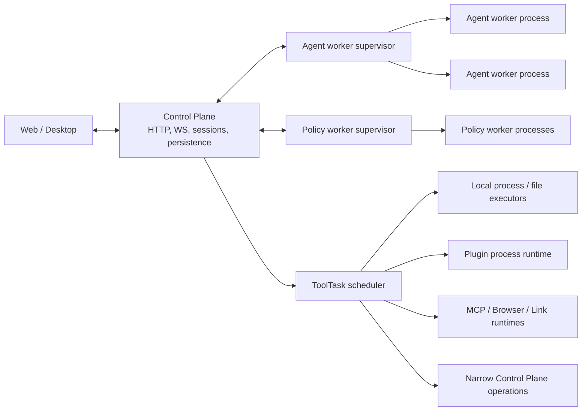

# Runtime and Scope

## Runtime Model

Synergy has one server runtime that can serve multiple clients and multiple project contexts. The process is not bound to the directory from which it was started; each scoped request supplies a `scopeID` or directory, and each session persists its own Scope and workspace binding.

The same runtime can be launched through several ownership surfaces:

| Launch path                                  | Ownership                                                                             |
| -------------------------------------------- | ------------------------------------------------------------------------------------- |
| `synergy start`                              | Installs and starts the user background service through the platform service manager. |
| `synergy server`                             | Runs the server in the foreground for direct operation or debugging.                  |
| Desktop managed mode                         | The Electron app owns a packaged local server and its lifecycle.                      |
| Source `bun dev server`, `web`, or `desktop` | The source development orchestrator owns the selected development processes.          |
| `synergy send` without `--attach`            | Starts an ephemeral local server for the one-off invocation.                          |
| `web` or `send --attach`                     | Connects to an already running runtime and does not own it.                           |

`SYNERGY_HOME` redirects the complete installation home, including config, data, state, logs, credentials, daemon records, and locks. One server owns a given `SYNERGY_HOME` at a time.

## Global Runtime

`GlobalRuntime.start()` runs once per server process inside the home Scope. It starts or initializes:

- plugin discovery and runtime initialization
- home-scope session recovery
- configured Channels and outbound channel delivery
- the optional Holos runtime
- global file watching
- MCP startup
- plugin marketplace registry prefetch
- pending session invocation recovery
- Agenda and its built-in bootstrap items
- the bounded Agent and Policy worker pools plus the ToolTask scheduler

Stopping the global runtime first stops Agent, Policy, and tool admission, cancels or drains their owned work, and then stops Agenda, Channels, MCP, project Scope runtimes, and other process-owned resources.

Global services may still perform scoped work. They must enter the relevant `ScopeContext` before reading scoped configuration, storage, files, or session state.

## Execution Topology

The server process is the Control Plane. It owns HTTP and WebSocket availability, session generation leases, canonical Session/Message writes, event ordering, permission state, tool scheduling, recovery, and aggregate observability. It assembles and releases the immutable turn snapshot, while provider request serialization, network streaming, response parsing, and their retained working sets run outside its event loop.



Every product LLM turn, including sessionless title, summary, classification, and agent-generation calls, enters `AgentTurn`. Production uses a bounded pool of recyclable Bun child processes; only tests use the in-process adapter. The Control Plane resolves final prompt and parameter plugin hooks plus a serializable provider runtime plan before admission. The worker reconstructs built-in provider runtime functions from that plan without provider-plugin discovery, so it cannot initialize plugin runtimes or call Host Services. A worker owns one provider turn at a time and is released before permission or tool waiting begins. Workers cannot receive executable tool callbacks and do not write canonical Session, Message, event, or observability state.

The Agent protocol is versioned and schema-validated. A turn snapshot is limited to 64 MiB, transferred in at most 1 MiB chunks, and advanced by per-chunk acknowledgements. Stream events are limited to 2 MiB frames; text and reasoning deltas are coalesced, and the next frame is acknowledged only after the Control Plane consumer has drained the current frame. Queue item counts and aggregate queued bytes are bounded independently. Cancellation has a grace deadline, heartbeats detect stuck workers, and workers terminate or recycle after a configured turn count, RSS threshold, or heap-used threshold.

Capability classification runs in a separate prewarmed Policy worker pool. Global-runtime startup begins prewarming without making HTTP/WebSocket availability depend on a child-process handshake. A classification that reaches a cold pool waits at most ten seconds for the first ready worker, so startup is bounded but not charged to the shorter request deadline. The Control Plane sends only a schema-validated, byte-bounded snapshot of the tool name, arguments, and classification context; the worker returns a capability envelope and never owns profile decisions, permission state, canonical writes, or tool execution. Once the pool is ready, each request has one total queue/transfer/classification deadline. A startup timeout, request timeout, process crash, invalid protocol message, or memory/heartbeat violation produces a finite opaque `protected_op` result and an immediate transient denial without entering approval, including under `guarded` and `full_access`. Workers recycle after bounded request counts or memory watermarks. Pre-ready failures use bounded exponential backoff and a startup circuit so a broken worker executable cannot create a Control Plane respawn storm.

`ToolScheduler` is the asynchronous boundary between proposed model tool calls and execution. It applies process-wide and per-executor-class admission limits, byte-bounded queues, generation-aware idempotency, cancellation, and terminal accounting. The executor classes are local process, file, plugin, MCP, Browser, Link, and narrow Control Plane operations. Physical isolation follows the capability: Bash and command-based search own child processes and bounded pipes, plugins reuse the plugin process runtime, and MCP, Browser, and Link retain their canonical transports/runtimes. File and canonical-state operations remain scheduled in the Control Plane when their implementation depends on its single-writer state; executor classification does not weaken permission, sandbox, Scope, or ownership rules.

The Control Plane is the only canonical observability writer. Agent and Policy workers send bounded execution data back through their protocols and do not initialize the performance store. Provider credential file updates use a process-safe lock so concurrent worker refreshes cannot lose writes.

## Scope

`Scope` is the canonical workspace context. It has two forms:

| Type    | ID                | Meaning                                                                                                    |
| ------- | ----------------- | ---------------------------------------------------------------------------------------------------------- |
| Home    | `home`            | Installation-wide work and data rooted at the Synergy home directory.                                      |
| Project | Stable project ID | A user-selected project boundary with project metadata, VCS information, and known sandbox/worktree paths. |

### Directory resolution

`Scope.fromDirectory()` treats the selected directory as the project boundary.

- It sanitizes and resolves the supplied path.
- It does not walk upward looking for `.git`, `package.json`, or another guessed project root.
- If the selected directory contains `.git`, it records Git identity and worktree information without changing the selected boundary.
- A Git-backed Scope uses a stable repository identity when available and tracks additional worktree/sandbox paths under the same project record.
- A non-Git directory uses a stable hash of its resolved path.
- A missing directory resolves to home and causes a matching stale project record to be archived.

The user therefore chooses the project boundary. Code must not reintroduce implicit upward repository discovery.

### Scope identity and execution path

Scope ownership and the current execution directory are related but distinct:

- `scope.id` owns scoped storage, events, configuration, and project identity.
- `scope.directory` is the active project/sandbox directory represented by that Scope value.
- `scope.worktree` records the persisted main worktree or repository anchor.
- `session.workspace.path` is the path in which that session currently executes.

`ScopeContext.current.directory` returns the active session workspace path when a workspace is present; otherwise it returns the Scope directory. This lets a session execute in an isolated worktree while its events and data remain owned by the original project Scope.

## Session Workspace

A session workspace contains at least:

```ts
{
  type: string
  path: string
  scopeID: string
}
```

The schema is intentionally open to workspace-specific metadata. New sessions default to the main workspace at the Scope directory. Child sessions inherit the parent workspace unless the caller supplies another binding.

Workspace selection supports:

- `current` — use the current Scope directory
- `existing` — bind to an existing worktree target
- `create` — create an isolated worktree, optionally from the current or a fresh base

Workspace transitions update session state; they do not create a new Scope merely because the execution path changes.

## Project Scope Runtime

`ScopeRuntime.ensure()` lazily starts project-sensitive services once per project Scope ID:

- plugin initialization in scoped context
- project session recovery
- formatter state
- language servers
- project file watching and file services
- VCS state
- the listener that records project initialization after the built-in init command

Home does not start a second project runtime because its installation-wide services are owned by `GlobalRuntime`.

Scope-local state uses `ScopedState`, keyed by Scope ID. Disposing a Scope runtime:

1. removes its started marker,
2. disposes registered scoped state,
3. publishes `scope.runtime.disposed`, and
4. causes subscribed clients to resynchronize that Scope if they still display it.

Failed asynchronous state initialization is evicted rather than cached permanently, so a later access can retry.

## Request Scoping

The server middleware resolves a request into one Scope before the route handler runs.

- Global routes and routes that require no explicit project context use home.
- Scoped routes accept a Scope ID or directory.
- An unknown Scope ID returns an error instead of silently falling back to another project.
- Directory-based requests use `Scope.fromDirectory()`.
- The resolved Scope is installed in `ScopeContext` for the complete handler.

GET responses produced inside a Scope advertise the current event watermark through `x-synergy-seq` and `x-synergy-epoch`. These headers describe the Scope runtime that produced the snapshot; see [Frontend data sync](frontend-data-sync.md).

## Session Execution Context

`SessionManager.run()` restores both the persisted Scope and workspace before executing a session loop. Code reached through a session should use `ScopeContext.current` rather than process working-directory assumptions.

Execution-context checks reject sessions whose Scope or workspace cannot be used safely. This is especially important for:

- restored sessions whose project directory disappeared
- worktree sessions
- Cortex child sessions
- Agenda and Channel endpoints
- remote or background invocations after a runtime restart

## Configuration Context

Global configuration is resolved from the home context. Project configuration is added only for project-scoped work. Configuration reload disposes the affected Scope runtime so cached project services restart against the new effective configuration.

The exact domain files and precedence are defined in the [configuration reference](../reference/configuration.md).

## Invariants

- A server process is installation-scoped, not project-scoped.
- Every project-sensitive operation runs inside an explicit Scope.
- The selected directory is the project boundary; no upward discovery occurs.
- Scope ID owns state and events; session workspace owns the active execution path.
- A worktree workspace does not redirect events into a second frontend Scope store.
- Global services enter a Scope before accessing scoped state.
- The Control Plane is the single writer for Session, Message, event ordering, permission state, and performance storage.
- Production provider streams run only in Agent worker processes; workers never receive executable tools or retain capacity while tools wait.
- Production capability classification runs only in Policy worker processes; timeout, crash, and malformed-output paths return a finite conservative classification.
- Every Agent or Policy IPC frame and Agent/Policy/Tool queue has an explicit byte and item bound.
- Project runtimes start lazily, once per Scope ID, and are disposable.
- Runtime ownership follows the launch surface; one client must not stop or replace a runtime owned by another surface.
