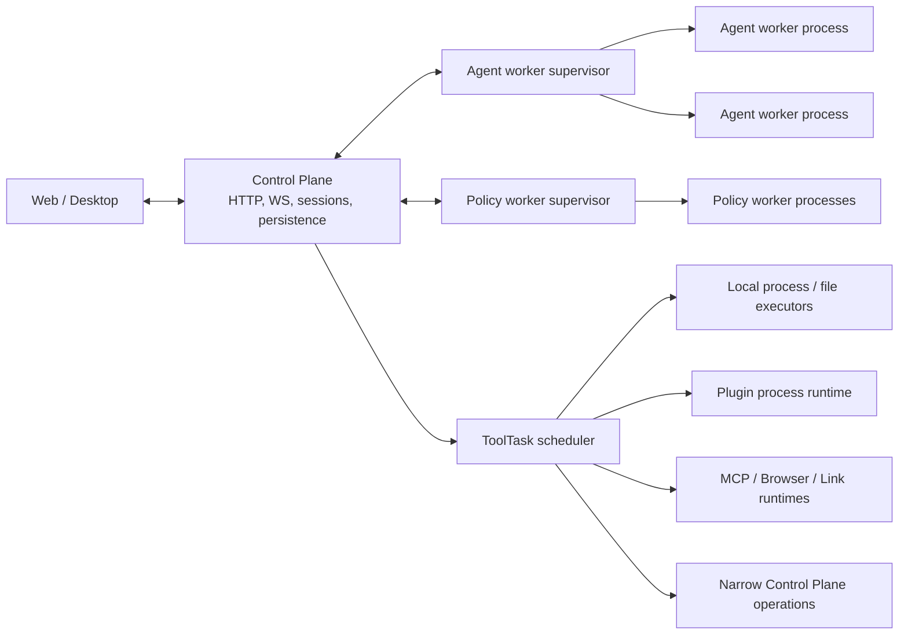

# Runtime and Scope

The Runtime owns an explicit transactional Agent Storage Handle independently of Scope directories. It completes database upgrade and recovery before admission, then drains and closes owned storage during shutdown. See [Agent storage](agent-storage.md) for authority, ownership, engine and file-commit boundaries.

## Runtime Model

A process may host multiple independent Runtime instances. Each instance has an immutable `RuntimeHost` (`home`, `root`, environment), an explicitly selected composition, and an owned or borrowed Storage Handle. One writing Runtime owns a Home at a time. Harness can run without an HTTP server; a server composition exposes its instance to multiple clients and project contexts. The runtime is not bound to the launch directory: scoped operations select a `scopeID` or directory, and each session persists its own Scope and workspace binding.

The same runtime can be launched through several ownership surfaces:

| Launch path                                  | Ownership                                                                             |
| -------------------------------------------- | ------------------------------------------------------------------------------------- |
| `synergy start`                              | Installs and starts the user background service through the platform service manager. |
| `synergy server`                             | Runs the server in the foreground for direct operation or debugging.                  |
| Desktop managed mode                         | The Electron app owns a packaged local server and its lifecycle.                      |
| Source `bun dev server`, `web`, or `desktop` | The source development orchestrator owns the selected development processes.          |
| `synergy send` without `--attach`            | Opens an in-process task runtime, executes directly, flushes evidence and closes.     |
| `web` or `send --attach`                     | Connects to an already running runtime and does not own it.                           |

`SYNERGY_HOME` redirects the complete installation home, including config, data, state, logs, credentials, daemon records, and locks. One writing runtime owns a given `SYNERGY_HOME` at a time.

## Composition and migration registration

`RuntimeHandle.open({ host, composition, storage, ... })` creates the instance, registers Harness and the selected composition, validates the startup graph, and seals that instance's registration before opening storage and running migrations. Imports define capabilities without activating them. Local and product hosts select their composition explicitly; importing product modules does not add capabilities to a core Runtime.

`handle.run()` enters the owning instance; `handle.bind()` captures it for callbacks crossing native or transport boundaries. Runtime registries, configuration, credentials, provider catalogs, event buses, workers, caches, timers and resources belong to that instance. Scope, workspace, observability, experiment, migration-target and rollout contexts reject inherited values from another Runtime. Rollout identity, transport evidence sinks and tool completion callbacks share this ownership boundary; leaving the Runtime also leaves those contexts. A disposed handle rejects work and cannot recreate its state. A storage transaction cannot switch Runtime owners.

Owned storage follows prepare, migrate, validate, activate and admission ordering. Borrowed storage retains the caller's close responsibility and cannot be attached to a second live Runtime. Opening failure or cancellation releases resources already acquired. Closing is idempotent: close admission, cancel execution, drain owned tasks and child streams, dispose Scope and composition services, flush telemetry, close owned storage, then release Home ownership. Callback work cannot outlive the instance that owns it.

Registration is sealed per instance. Identical contributions may be repeated where the owning registry permits it; conflicts and new contributions after opening fail explicitly. A later Runtime starts with a fresh registry. Tests can compose core and product instances together in one process and close either independently. Offline migration fixtures use an explicit unsealed context and isolated storage.

The migration tracking upgrade moves only IDs recognized by registered owners out of the old combined log. Unregistered IDs remain in that log so a later process with the owning capability can recover its history. `registerLibrary()` and `registerNote()` assemble each domain's migrations, tools, and lifecycle contributions before runtime startup; they do not require the full product manifest or plugin delivery to be installed.

Startup migrations finish before HTTP requests are admitted. Managed Desktop receives versioned aggregate migration progress from the CLI reporter, keeps waiting while work advances, and displays the current step in its startup overlay. Migration callbacks accept an optional nonnegative phase index, starting at zero. Multi-scan migrations advance the phase before preparing each independent scan; the runner announces a new reporter step and resets progress throttling. Counts are monotonic within a phase, and reports from earlier phases are ignored. The [development reference](../reference/development.md) defines startup waiting limits; the [decision record](../decisions/implemented/bug-fix/2026-09-08-desktop-migration-progress-wait.md) explains the progress-based deadline.

## Global Runtime

The full product’s `GlobalRuntime.start()` runs once per resident Runtime inside its Home Scope. Product Runtime selects the services below; a standalone local task enables its selected execution services without starting resident product services:

- plugin discovery and runtime initialization
- home-scope session recovery
- configured Channels and outbound channel delivery
- the optional Holos runtime
- global file watching
- MCP startup
- plugin marketplace registry prefetch
- pending session invocation recovery
- Agenda and its built-in bootstrap items
- the bounded Agent and Policy worker pools plus the ToolTask scheduler

Shutdown admission closes as soon as the process receives its first termination signal: HTTP requests return `503 RuntimeShuttingDown`, and Agent, Policy, and tool admission closes synchronously before any shutdown await so no new execution can escape the process drain. The runtime force-exit deadline is derived from the largest configured execution cancellation grace plus a settlement margin; Desktop's managed-server supervisor and the generated systemd user unit both wait beyond the maximum supported runtime deadline before force-killing the process. Shutdown then stops Agenda, Channels, MCP, project Scope runtimes, and other Runtime-owned resources before actively closing remaining HTTP, SSE, and WebSocket connections.

Global services may still perform scoped work. They must enter the relevant `ScopeContext` before reading scoped configuration, storage, files, or session state.

## Execution Topology

The runtime host process is the Control Plane. It owns session generation leases, canonical Session/Message writes, event ordering, permission state, tool scheduling, recovery, and aggregate observability. Server compositions additionally own HTTP and WebSocket availability. It assembles and releases the immutable turn snapshot, while provider request serialization, network streaming, response parsing, and their retained working sets run outside its event loop.

```mermaid
flowchart LR
  Client["Web / Desktop"] <--> CP["Control Plane<br/>HTTP, WS, sessions, persistence"]
  CP <--> Pool["Agent worker supervisor"]
  Pool --> A1["Agent worker process"]
  Pool --> A2["Agent worker process"]
  CP <--> PolicyPool["Policy worker supervisor"]
  PolicyPool --> Policy["Policy worker processes"]
  CP --> Scheduler["ToolTask scheduler"]
  Scheduler --> Local["Local process / file executors"]
  Scheduler --> Plugin["Plugin process runtime"]
  Scheduler --> Remote["MCP / Browser / Link runtimes"]
  Scheduler --> Internal["Narrow Control Plane operations"]
```

Every product LLM turn, including sessionless title, summary, classification, and agent-generation calls, enters `AgentTurn`. Production uses a bounded pool of recyclable Bun child processes; only tests use the in-process adapter. The Control Plane resolves final prompt and parameter plugin hooks plus a serializable provider runtime plan before admission. The worker reconstructs built-in provider runtime functions from that plan without provider-plugin discovery, so it cannot initialize plugin runtimes or call Host Services. A worker owns one provider turn at a time and is released before permission or tool waiting begins. Workers cannot receive executable tool callbacks and do not write canonical Session, Message, event, or observability state.

The Agent worker pool has a live target capacity. Global-runtime startup prewarms the pool toward its configured warm reserve (`agentWorkerMinIdle`, default one) without making HTTP/WebSocket availability depend on a worker handshake, so the first turn normally finds a ready worker. Increasing the target starts workers immediately. Decreasing it removes excess idle workers first and marks only the remaining excess active workers to retire after their owned turns reach a terminal boundary. Resizing alone never aborts an active turn; subsequent target changes recompute the retirement set. Idle-timeout and turn-count recycling replace the warm reserve instead of emptying the pool below it.

The Agent protocol is versioned and schema-validated. A turn snapshot is limited to 64 MiB, transferred in at most 1 MiB chunks, and advanced by per-chunk acknowledgements. Stream events are limited to 2 MiB frames; text and reasoning deltas are coalesced, and the next frame is acknowledged only after the Control Plane consumer has drained the current frame. Queue item counts and aggregate queued bytes are bounded independently. Cancellation has a grace deadline, heartbeats detect stuck workers, and workers terminate or recycle after a configured turn count, RSS threshold, or heap-used threshold.

Capability classification runs in a separate prewarmed Policy worker pool. Global-runtime startup begins prewarming without making HTTP/WebSocket availability depend on a child-process handshake. A classification that reaches a cold pool waits at most ten seconds for the first ready worker, so startup is bounded but not charged to the shorter request deadline. The Control Plane sends only a schema-validated, byte-bounded snapshot of the tool name, arguments, and classification context; the worker returns a capability envelope and never owns profile decisions, permission state, canonical writes, or tool execution. Once the pool is ready, each request has one total queue/transfer/classification deadline. A startup timeout, request timeout, process crash, invalid protocol message, or memory/heartbeat violation produces a finite opaque `protected_op` result without entering approval. That result is an immediate transient denial under `guarded` and `autonomous`, and is fail-open under `full_access`, whose entire purpose is to pre-authorize capabilities it has not yet seen; see [Execution boundaries](execution-boundaries.md#control-profiles). Workers recycle after bounded request counts or memory watermarks. Pre-ready failures use bounded exponential backoff and a startup circuit so a broken worker executable cannot create a Control Plane respawn storm.

`ToolScheduler` is the asynchronous boundary between proposed model tool calls and execution. It applies Runtime-wide and per-executor-class admission limits, byte-bounded queues, generation-aware idempotency, cancellation, and terminal accounting. The executor classes are local process, file, plugin, MCP, Browser, Link, and narrow Control Plane operations. Physical isolation follows the capability: Bash and command-based search own child processes and bounded pipes, plugins reuse the plugin process runtime, and MCP, Browser, and Link retain their canonical transports/runtimes. File and canonical-state operations remain scheduled in the Control Plane when their implementation depends on its single-writer state; executor classification does not weaken permission, sandbox, Scope, or ownership rules.

The Control Plane is the only canonical observability writer. Agent and Policy workers send bounded execution data back through their protocols and do not initialize the performance store. Provider credential file updates use a process-safe lock so concurrent worker refreshes cannot lose writes.

## Scope

`Scope` identifies ownership of sessions, configuration and events. Its required `local` field is either local filesystem metadata (`directory`, `worktree`, `vcs`, `sandboxes`) or `null`. Scope identity does not imply a filesystem workspace. It has two forms:

| Type    | ID                | Meaning                                                                                                    |
| ------- | ----------------- | ---------------------------------------------------------------------------------------------------------- |
| Home    | `home`            | Installation-wide work and data; `local: null` grants no workspace access.                                 |
| Project | Stable project ID | A user-selected project boundary with project metadata, VCS information, and known sandbox/worktree paths. |

### Directory resolution

`Scope.fromDirectory()` treats the selected directory as the project boundary.

- It sanitizes and resolves the supplied path.
- It does not walk upward looking for `.git`, `package.json`, or another guessed project root.
- If the selected directory contains `.git`, it records Git identity and worktree information without changing the selected boundary.
- A Git-backed Scope uses a stable repository identity when available and tracks additional worktree/sandbox paths under the same project record.
- A non-Git directory uses a stable hash of its resolved path.
- An explicit missing directory fails with `WorkspaceUnavailable`; it never resolves to Home. Missing and archived projects retain their identity and readable history.
- Discovery-only resolution may use a transient Scope without registering the directory, writing Git identity cache files or emitting Scope events.
- When both `scopeID` and a directory are supplied, the stable Scope ID owns resolution. No selector means Home; there is no implicit current-directory lookup.

The user therefore chooses the project boundary. Code must not reintroduce implicit upward repository discovery.

### Project folders (multi-root trust boundary)

A project Scope can declare multiple folders: the main `local.worktree` plus additional `local.sandboxes` entries persisted under the same project record. `Scope.fromDirectory()` appends opened worktree/related directories to `local.sandboxes`, and the Web project editor manages the list explicitly. `scope.update` requires the canonical path `scopeID`. Directory hints cannot register or redirect a project during an update; an unknown ID fails explicitly. Clients resolve a directory before updating its Scope.

The canonical derivation lives in `Scope.Root`:

- `Scope.Root.projectRoots(scope)` — `[local.worktree, ...local.sandboxes]`, absolute,
  deduplicated, existing directories only. This is the single source of truth for "which directories belong to this project Scope".
- `Scope.Root.trustRoots(scope, workspace)` — project roots for the current
  session; in a `git_worktree` session the original main checkout is excluded so it stays outside the trust boundary.
- `Scope.Root.executionRoots(scope, workspace, extraRoots)` — trust roots
  merged with caller-provided roots (e.g. Skill source roots); every `EnforcementGate` creation site uses this so project folders are trusted automatically.

The execution boundary, sandbox policy, system prompt, and file-tool containment checks all consume these roots. In a worktree session, sibling worktrees declared as project folders are trusted — only the original checkout remains external and requires explicit authorization.

### Scope identity and execution path

Scope ownership and the current execution directory are related but distinct:

- `scope.id` owns scoped storage, events, configuration, and project identity.
- `scope.local.directory` is the active project/sandbox directory represented by that Scope value.
- `scope.local.worktree` records the persisted main worktree or repository anchor.
- `session.workspace.path` is the path in which that session currently executes.

`ScopeContext.current.workspace` is the explicit workspace binding or `null`. `current.directory` requires a workspace and throws `WorkspaceRequired` otherwise. Entering a Scope without an explicit workspace selects its local directory only when `scope.local` exists. Entering a session always supplies its persisted binding, including `null`, so a workspace-free session inside a project cannot regain filesystem access implicitly.

## Session Workspace

Sessions persist a canonical `workspaceID` reference, with `null` representing no filesystem workspace. Their public `workspace` descriptor projects the current catalog binding and metadata. Missing catalog entries retain their ID and expose an error rather than becoming workspace-free. The [Workspace and files](workspace-and-files.md) contract defines catalog identity, generation and native-resource ownership.

New sessions default to the Scope local directory, or `null` for Home and other nonlocal Scopes. Child sessions inherit their parent Scope and Workspace, including `null`, unless the caller explicitly changes them. Bindings must belong to the session Scope.

Workspace selection supports:

- `none` — persist `null` and retain the session Scope
- `current` — use the Scope local directory; reject a Scope with no local binding
- `workspace` — select a registered Workspace ID with an expected binding generation
- `existing` — bind to an existing worktree target
- `create` — create an isolated worktree, optionally from the current or a fresh base

Workspace transitions update session state; they do not create a new Scope merely because the execution path changes. Submission validates the persisted binding before writing input or scheduling a turn. An unavailable or archived workspace rejects execution while history remains readable.

Tools declare `requiresWorkspace` independently of permission profiles. Discovery omits workspace tools for a null binding, and retained tool handles check again before execution. `full_access` does not bypass workspace availability. Network, session, Notes, Library and managed Asset operations can operate without a workspace when their owning capability declares that support. Undeclared plugin and MCP requirements default to requiring a workspace.

The Scope migration changes metadata only. Session bindings upgrade lazily when records are accessed, including deferred legacy import; message payloads and rollout evidence are not rewritten during Runtime startup. The owner applies the same canonical normalization for upgrade and import.

## Project Scope Runtime

`ScopeRuntime.ensure()` lazily starts project-sensitive services once per project Scope ID:

- plugin initialization in scoped context
- project session recovery
- formatter state
- language servers
- project file watching and file services
- VCS state
- the listener that records project initialization after the built-in init command
- startup listeners that rebind services owned by an active global subsystem before recovery can publish Scope-local events, including Channel question and outbound bridges for connected accounts

Home does not start a second project runtime because its installation-wide services are owned by `GlobalRuntime`.

Scope-local state uses `ScopedState`, keyed by Scope ID. Disposing a Scope runtime:

1. removes its started marker and disables new detached plugin Agent calls for that Scope,
2. synchronously claims and aborts matching calls, releasing admission capacity before terminal delivery completes,
3. waits for their single `cancelled` delivery while the old scoped plugin state is still available,
4. disposes registered scoped state,
5. publishes `scope.runtime.disposed`, and
6. causes subscribed clients to resynchronize that Scope if they still display it.

Concurrent `ensure()` waits for an in-flight disposal before explicitly reactivating the Scope. Calls owned by another Scope are not cancelled, and a late provider result cannot replace the claimed terminal result.

An active Channel connection keeps its account-to-Scope ownership in the home runtime. When a disposable project runtime starts or restarts, Channel synchronously rebinds its Scope-local bridges before startup recovery can terminalize pending messages or publish their events. This preserves continuation replies and interactive cards across project configuration reloads without moving Channel connection ownership into the project runtime.

Failed asynchronous state initialization is evicted rather than cached permanently, so a later access can retry.

## Request Scoping

The server middleware resolves a request into one Scope before the route handler runs.

- Global routes and routes that require no explicit project context use home.
- Scoped routes accept a Scope ID or directory.
- An unknown Scope ID returns an error instead of silently falling back to another project.
- Directory-based requests use `Scope.fromDirectory()`.
- The resolved Scope is installed in `ScopeContext` for the complete handler.

GET responses produced inside a Scope advertise the current event watermark through `x-synergy-seq` and `x-synergy-epoch`. These headers describe the Scope runtime that produced the snapshot; see [Frontend data sync](frontend-data-sync.md).

## Session Execution Context

`SessionManager.run()` restores both the persisted Scope and workspace before executing a session loop. Code reached through a session should use `ScopeContext.current` rather than process working-directory assumptions.

Execution-context checks reject sessions whose Scope or workspace cannot be used safely. This is especially important for:

- restored sessions whose project directory disappeared
- worktree sessions
- Cortex child sessions
- Agenda and Channel endpoints
  Channel endpoint sessions are scoped to the Scope resolved from each account's project directory configuration. `Session.findForEndpoint()`, `getOrCreateForEndpoint()`, and `archiveForEndpoint()` require an explicit `{ scope: Scope }` options object and reject cross-Scope reuse. This keeps session reuse confined to the owning Scope and prevents endpoint sessions from leaking across managed Projects.
- remote or background invocations after a runtime restart

## Configuration Context

Global configuration is resolved from the home context. Project configuration is added only for project-scoped work. Configuration reload disposes the affected Scope runtime so cached project services restart against the new effective configuration.

The exact domain files and precedence are defined in the [configuration reference](../reference/configuration.md).

## Invariants

Runtime startup recovers committed execution history under exclusive Home ownership before opening HTTP admission. The host may observe aggregate recovery work through `RuntimeHandle` without changing journal replay or evidence validation. Managed Desktop uses those advancing counts to distinguish active recovery from a stalled startup; [Development](../reference/development.md) defines its waiting policy.

- A server process is installation-scoped, not project-scoped.
- Every project-sensitive operation runs inside an explicit Scope.
- The selected directory is the project boundary; no upward discovery occurs.
- Scope ID owns state and events; session workspace owns the active execution path.
- A worktree workspace does not redirect events into a second frontend Scope store.
- Global services enter a Scope before accessing scoped state.
- The Control Plane is the single writer for Session, Message, event ordering, permission state, and performance storage.
- Production provider streams run only in Agent worker processes; workers never receive executable tools or retain capacity while tools wait.
- Agent worker pool shrink never aborts an active turn; excess active workers retire only after their owned turns terminate.
- Production capability classification runs only in Policy worker processes; timeout, crash, and malformed-output paths return a finite conservative classification.
- Every Agent or Policy IPC frame and Agent/Policy/Tool queue has an explicit byte and item bound.
- Project runtimes start lazily, once per Scope ID, and are disposable.
- Project Scope disposal cancels only its detached plugin Agent calls before scoped state is removed; explicit reactivation is required before new calls are admitted.
- Runtime ownership follows the launch surface; one client must not stop or replace a runtime owned by another surface.

Runtime extension shutdown follows execution and background-job draining. The complete composition invokes Browser and Library owner disposal; independent hosts connect the same public `disposeBrowser()` and `disposeLibrary()` operations through `RuntimeServices.disposeExtensions`. Browser registration and suspended owner-state reads do not launch Chromium. The root `script/runtime-composition-check.ts` installs packed dependency closures outside the repository and verifies execution, persistence, optional-package absence, resource closure and natural process exit.
